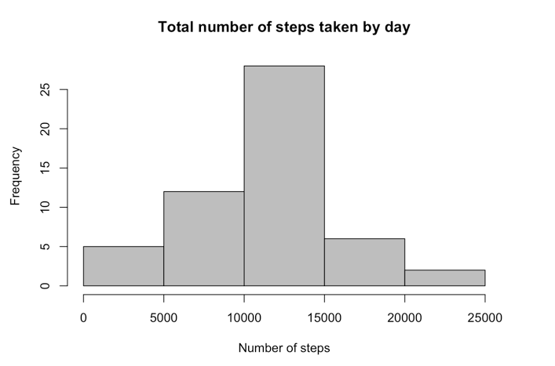

This assignment makes use of data from a personal activity monitoring device. This device collects data at 5 minute intervals through out the day. The data consists of two months of data from an anonymous individual collected during the months of October and November, 2012 and include the number of steps taken in 5 minute intervals each day.

First, let us read the data file 
(csv data file placed in same directory as the R markdown file)

```r
actData <- read.csv("activity.csv")
actData$date <- as.Date(actData$date, "%Y-%m-%d")
str(actData)
```

```
## 'data.frame':	17568 obs. of  3 variables:
##  $ steps   : int  NA NA NA NA NA NA NA NA NA NA ...
##  $ date    : Date, format: "2012-10-01" "2012-10-01" ...
##  $ interval: int  0 5 10 15 20 25 30 35 40 45 ...
```
Moving on to the analysis of activity data

**Q1: What is the total number of steps taken per day ? **

Answer: The graph below depicts the frequncy distribution on number of steps aggregated by the day.

```r
stepsperday<- aggregate(steps ~ date, data = actData, sum, na.rm = TRUE)
str(stepsperday)
```

```
## 'data.frame':	53 obs. of  2 variables:
##  $ date : Date, format: "2012-10-02" "2012-10-03" ...
##  $ steps: int  126 11352 12116 13294 15420 11015 12811 9900 10304 17382 ...
```

```r
hist(stepsperday$steps, main = "Total number of steps taken by day", xlab = "Number of steps", col = "grey")
```

 

**The mean of total steps taken per day is**

```r
mean(stepsperday$steps)
```

```
## [1] 10766.19
```

**The median of total steps taken per day is**

```r
medianSteps <- median(stepsperday$steps)
medianSteps
```

```
## [1] 10765
```

**Q2: What is the average daily activity pattern ? **
Answer: Here is a time series plot

```r
meanStepsPerDay <- aggregate(actData$steps, by = list(actData$interval), mean,na.rm=TRUE)
names(meanStepsPerDay) <- c("interval", "mean")

plot(meanStepsPerDay$interval,meanStepsPerDay$mean,type = "l", col = "red", 
     xlab = "Time interval", ylab = "Average steps per day", 
     main = "Daily activity pattern")
```

 

The time frame that contains maximum number of steps is computed as shown below

```r
time_frame <- meanStepsPerDay[which(meanStepsPerDay$mean == max(meanStepsPerDay$mean)),1]
time_frame
```

```
## [1] 835
```

**Q3: Imputing missing values**
Answer: To impute missing values, the procedure is as follows

**First create a new data frame for updated activity data**

```r
actData2 <- actData
names(actData2)
```

```
## [1] "steps"    "date"     "interval"
```
**For each NA value found in this data frame, repalce it with the median value**


```r
meanstep <- aggregate(steps ~ interval, data = actData, FUN = mean)
newSteps <- numeric()
for (i in 1:nrow(actData)) {
    reading <- actData[i, ]
    if (is.na(reading$steps)) {
        stepValue <- subset(meanstep, interval == reading$interval)$steps
    }
    else{
        stepValue <- reading$steps
    }
    newSteps <- c(newSteps,stepValue)
}
summary(newSteps)
```

```
##    Min. 1st Qu.  Median    Mean 3rd Qu.    Max. 
##    0.00    0.00    0.00   37.38   27.00  806.00
```

```r
actData2$steps <- newSteps
summary(actData2)
```

```
##      steps             date               interval     
##  Min.   :  0.00   Min.   :2012-10-01   Min.   :   0.0  
##  1st Qu.:  0.00   1st Qu.:2012-10-16   1st Qu.: 588.8  
##  Median :  0.00   Median :2012-10-31   Median :1177.5  
##  Mean   : 37.38   Mean   :2012-10-31   Mean   :1177.5  
##  3rd Qu.: 27.00   3rd Qu.:2012-11-15   3rd Qu.:1766.2  
##  Max.   :806.00   Max.   :2012-11-30   Max.   :2355.0
```
To recalculate the steps per day with the new data set where NA is replaced by the median value


```r
StepsperDay2 <- aggregate(steps ~ date, data = actData2, sum, na.rm = TRUE)
hist(StepsperDay2$steps, main = "Total number of steps taken by day - Imputed missing values", xlab = "Number of steps", col = "blue")
```

 

The mean and median for the new data set are

```r
mean(StepsperDay2$steps)
```

```
## [1] 10766.19
```

```r
median(StepsperDay2$steps)
```

```
## [1] 10766.19
```

**Q4: Are there differences in activity patterns between weekdays and weekends?**

Answer: the readings are classified into weekend and weekday using a new factor variable


```r
day <- weekdays(actData$date)
time_of_week <- vector()
for (i in 1:nrow(actData)) {
    if (day[i] == "Saturday") {
        time_of_week[i] <- "Weekend"
    } else if (day[i] == "Sunday") {
        time_of_week[i] <- "Weekend"
    } else {
        time_of_week[i] <- "Weekday"
    }
}
actData$time_of_week <- time_of_week
actData$time_of_week <- factor(actData$time_of_week)

stepsByDay <- aggregate(steps ~ interval + time_of_week, data = actData, mean)
names(stepsByDay) <- c("interval", "time_of_week", "steps")
```
Now, to compare the difference in steps recorded over weekdays and weekends, this panel grpah will show the differences


```r
library(lattice)
xyplot(steps ~ interval | time_of_week, stepsByDay, type = "l", layout = c(1, 2), 
       xlab = "Interval", ylab = "Number of steps")
```

 
